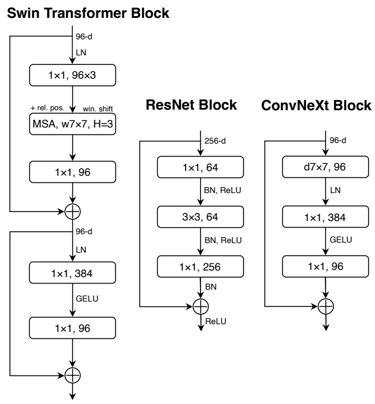

# PyTorch Implementation of ConvNeXt (for performance comparison in paper "Neural Network Application for Assessing Thyroid-Associated Orbitopathy Activity using Orbital Computed Tomography")
 
The preprocessing and architecture can be referenced by a manuscript entitled, "A convnet for the 2020s." 

## Overview
This repository contains an unofficial implementation of ConvNeXt using PyTorch.<br/>


## Neural Network Block

## Paper
If you use this software for your research, please cite:

```bibtex
@inproceedings{liu2022convnet,
  title={A convnet for the 2020s},
  author={Liu, Zhuang and Mao, Hanzi and Wu, Chao-Yuan and Feichtenhofer, Christoph and Darrell, Trevor and Xie, Saining},
  booktitle={Proceedings of the IEEE/CVF conference on computer vision and pattern recognition},
  pages={11976--11986},
  year={2022}
}
```

## License
This program is available for download for non-commercial use, licensed under the GNU General Public License. This allows its use for research purposes or other free software projects but does not allow its incorporation into any type of commercial software.

## Files
The repository contains the following files:
- `ConvNeXt.py`: Python script file, containing the PyTorch implementation of the ConvNeXt.
- `README.md`: Markdown file explaining the model source code.
